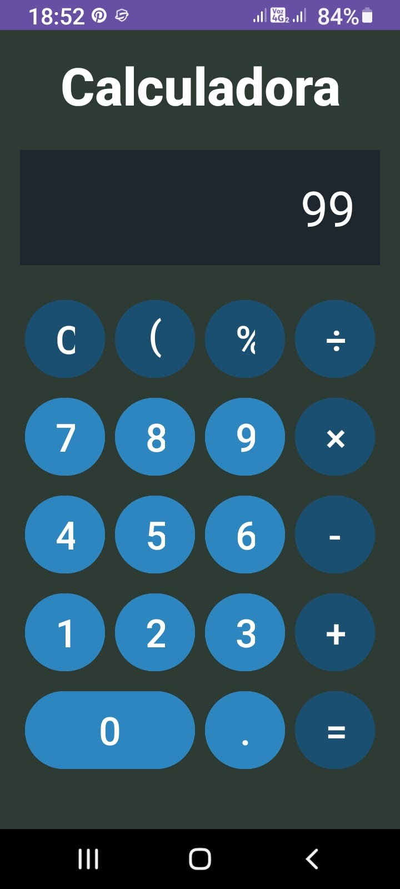
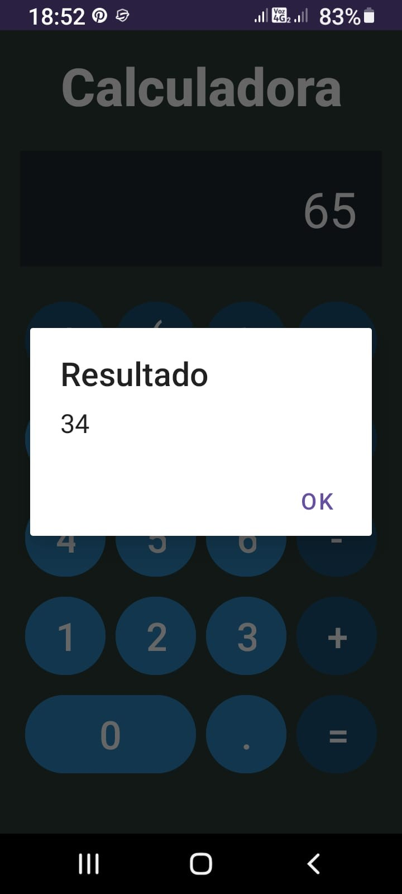

# 🧮 Calculadora Android

Una calculadora moderna para Android con una interfaz de usuario mejorada y funcionalidades básicas.


## ✨ Características

- 🎨 Interfaz gráfica moderna con fondo plomo verdoso oscuro
- 🔲 Botones con diseño moderno y fondo celeste oscuro
- 🔢 Operaciones básicas:
  - ➕ Suma
  - ➖ Resta
  - ✖️ Multiplicación
  - ➗ División
- ⚠️ Manejo de errores (división por cero)
- 💬 Resultados mostrados en diálogos
- 📱 Diseño responsivo

## 📋 Requisitos

- 📱 Android 7.0 (API 24) o superior
- 💻 Android Studio Arctic Fox o superior

## 🏗️ Estructura del Proyecto

El proyecto está organizado siguiendo las mejores prácticas de desarrollo Android:

```
📁 app/src/main/java/com/example/calculadora/
├── 📄 MainActivity.kt     # Actividad principal y lógica de la UI
├── 📄 Calculadora.kt     # Clase que implementa las operaciones
└── 📄 IOperaciones.kt    # Interfaz para las operaciones básicas
```

## 🚀 Instalación

1. 📥 Clona este repositorio
2. 📂 Abre el proyecto en Android Studio
3. 🔄 Sincroniza el proyecto con Gradle
4. ▶️ Ejecuta la aplicación en un emulador o dispositivo Android

## 📱 Uso

1. 🔢 Ingresa el primer número usando los botones numéricos
2. ⚡ Selecciona la operación deseada (+, -, ×, ÷)
3. 🔢 Ingresa el segundo número
4. ✅ Presiona = para ver el resultado
5. 💫 El resultado se mostrará en un diálogo y se copiará al display para continuar operando

## 📸 Capturas de Pantalla

<table>
  <tr>
    <td></td>
    <td></td>
    <td></td>
  </tr>
</table>

## 📝 Licencia

Este proyecto está bajo la Licencia MIT. 

## 🤝 Contribuir

Las contribuciones son bienvenidas! Si encuentras un bug o tienes una sugerencia:

1. 🍴 Haz un fork del proyecto
2. 🔨 Crea tu rama de características (`git checkout -b feature/AmazingFeature`)
3. 📝 Realiza tus cambios
4. 🔃 Haz push a la rama (`git push origin feature/AmazingFeature`)
5. 📫 Abre un Pull Request
